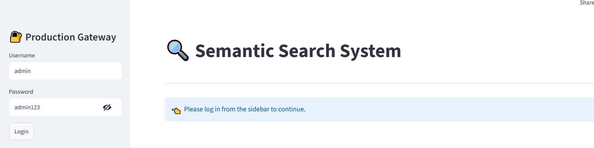
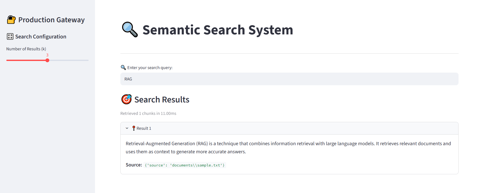

# 📂 Enterprise Semantic Search & Conversational RAG Ecosystem

[](https://www.python.org/)
[](https://www.langchain.com/)
[](https://github.com/facebookresearch/faiss)
[](https://streamlit.io/)

An end-to-end, enterprise-grade Retrieval-Augmented Generation (RAG) platform designed to ingest unstructured corporate knowledge assets (PDFs, TXT), compute localized dense vector embeddings, and serve high-context conversational query resolutions using open-source Large Language Models (LLMs) with zero infrastructure operational costs.

---

## 🚀 Live Production Links & Access
* **Interactive Frontend Dashboard:** [Streamlit Service UI](https://rag-semantic-search-ems8qse69ayc3cagr4ddq8.streamlit.app/#generative-llm-response)

### 🔑 Demo Evaluation Credentials
To bypass the secure access administrative boundary on the live production interface, please utilize the following credentials:
* **Username:** `admin`
* **Password:** `admin123`

## Dashboard



## Prediction Result

 

---
## Features

- Semantic search over documents
- PDF and TXT support
- Vector similarity retrieval
- FAISS vector database
- Streamlit web interface
- Hugging Face embeddings
- Login-based access control
- Query latency metrics
- Completely FREE (No OpenAI billing)

---

## Tech Stack

- Python
- LangChain
- Hugging Face Sentence Transformers
- FAISS
- Streamlit

---
---

## How It Works

### Step 1: Knowledge Base Ingestion (`ingest.py`)
Parses PDF and TXT documents, splits them into chunks using a recursive text splitter, generates dense vector embeddings using Hugging Face Sentence Transformers, and saves the FAISS index locally for fast retrieval.

### Step 2: Search Dashboard (`app.py`)
Loads the local FAISS index, handles login-based access control, accepts user queries, performs semantic similarity search, logs query latency metrics, and displays the most relevant document chunks with source metadata.

---

## Installation

```bash
git clone https://github.com/hirdeshraghuwanshi98-sys/rag-semantic-search.git
cd rag-semantic-search
pip install -r requirements.txt
```

---

## Run Locally

```bash
python ingest.py
streamlit run app.py
```

---

```

---

## Live Demo

https://rag-semantic-search-gfggptft4ekgecvqftgenp.streamlit.app/

---

## Resume Description

Developed a semantic search system using LangChain, Hugging Face embeddings, and FAISS to retrieve relevant information from PDF and text documents through vector similarity search, deployed on Streamlit Cloud with login-based access control and query latency logging.

---

## Future Improvements

- LLM answer generation via Groq
- Multi-document upload UI
- Conversational memory
- Cloud vector database
## 📂 Repository Blueprint

```text
## Project Architecture
User Query
↓
Embedding Generation (all-MiniLM-L6-v2)
↓
FAISS Similarity Search
↓
Retrieve Relevant Chunks
↓
Display Results with Metadata

rag-semantic-search/
│
├── ingest.py                 # Automated document processing & vector storage generator
├── app.py                    # Multi-tab operational Streamlit RAG interface
│
├── documents/                # Corporate raw knowledge source directory
│   └── sample.txt            # Local context payload targets
│
├── vectorstore/              # Serialized vector database metrics matrices
│   ├── index.faiss           # Meta FAISS high-dimensional vector array index
│   └── index.pkl             # Persisted metadata catalog matrix
│
├── logs/
│   └── rag_system.log        # Self-contained runtime validation execution logs
│
├── requirements.txt          # Explicitly pinned application package distributions
└── README.md                 # Interactive architectural summary documentation
