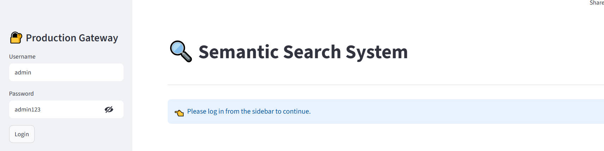
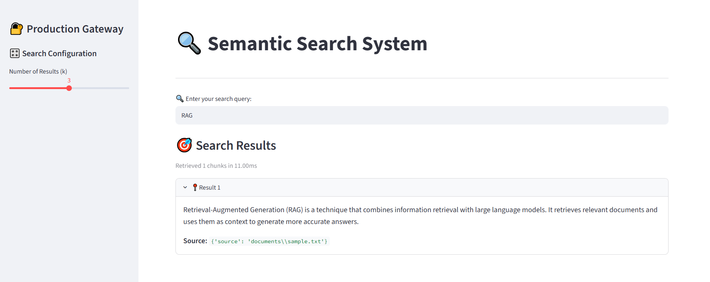

# 🔍 RAG-Based Semantic Document Search Engine

[](https://www.python.org/)
[](https://www.langchain.com/)
[](https://github.com/facebookresearch/faiss)
[](https://streamlit.io/)

An end-to-end, enterprise-grade Retrieval-Augmented Generation (RAG) platform designed to ingest unstructured corporate knowledge assets (PDFs, TXT), compute localized dense vector embeddings, and serve high-context conversational query resolutions using open-source Large Language Models (LLMs) with zero infrastructure operational costs.

---

## 🚀 Live Production Links & Access
* **Interactive Frontend Dashboard:** [Streamlit Service UI](https://rag-semantic-search-ems8qse69ayc3cagr4ddq8.streamlit.app/#generative-llm-response)

### 🔑 Demo Evaluation Credentials
To bypass the secure access administrative boundary on the live production interface, please utilize the following credentials:
* **Username:** `admin`
* **Password:** `admin123`

## Dashboard



## Prediction Result

 

# RAG Semantic Search

A small semantic search engine over your own PDF/TXT documents, built with
LangChain, Hugging Face sentence embeddings, and FAISS. Type a natural-language
question and get back the most relevant chunks of text — with an optional
LLM-generated answer on top.

## How it works

```
Your documents (.pdf / .txt)
        ↓
Split into chunks (RecursiveCharacterTextSplitter)
        ↓
Embed each chunk (all-MiniLM-L6-v2)
        ↓
Store vectors in a FAISS index
        ↓
User query → embedded the same way → compared via cosine similarity
        ↓
Top-k most similar chunks returned (+ optional LLM answer)
```

## Tech stack

- Python
- LangChain
- Hugging Face Sentence Transformers (`all-MiniLM-L6-v2`)
- FAISS (vector similarity search)
- Streamlit (UI)
- Groq (optional — generates a natural-language answer from retrieved chunks)

## Setup

```bash
git clone https://github.com/hirdeshraghuwanshi98-sys/rag-semantic-search.git
cd rag-semantic-search
pip install -r requirements.txt
```

Drop your `.pdf` / `.txt` files into `/documents`, then:

```bash
python ingest.py        # builds the FAISS vector index
streamlit run app.py    # launches the search UI
```

## Project structure

```
rag-semantic-search/
├── ingest.py          # loads documents, chunks them, builds the FAISS index
├── app.py             # Streamlit UI for querying the index
├── documents/         # put your source .pdf / .txt files here
├── vectorstore/        # generated FAISS index (index.faiss, index.pkl)
├── requirements.txt
└── README.md
```


## Possible extensions

- Multi-document upload through the UI
- Conversational memory across queries
- Swap FAISS for a hosted vector DB (Pinecone, Qdrant)
- 

---
## FAISS Similarity Search
↓
Retrieve Relevant Chunks
↓
Display Results with Metadata

rag-semantic-search/
│
├── ingest.py                 # Automated document processing & vector storage generator
├── app.py                    # Multi-tab operational Streamlit RAG interface
│
├── documents/                # Corporate raw knowledge source directory
│   └── sample.txt            # Local context payload targets
│
├── vectorstore/              # Serialized vector database metrics matrices
│   ├── index.faiss           # Meta FAISS high-dimensional vector array index
│   └── index.pkl             # Persisted metadata catalog matrix
│
├── logs/
│   └── rag_system.log        # Self-contained runtime validation execution logs
│
├── requirements.txt          # Explicitly pinned application package distributions
└── README.md                 # Interactive architectural summary documentation
